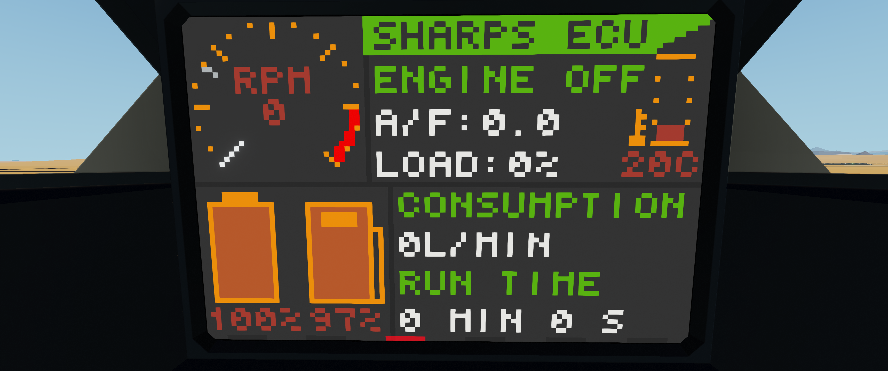
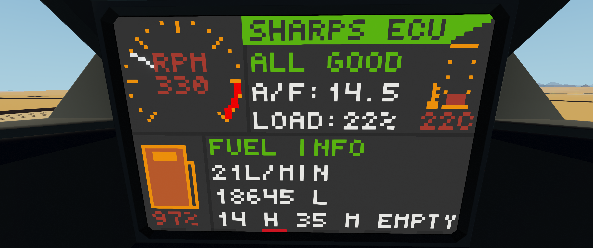
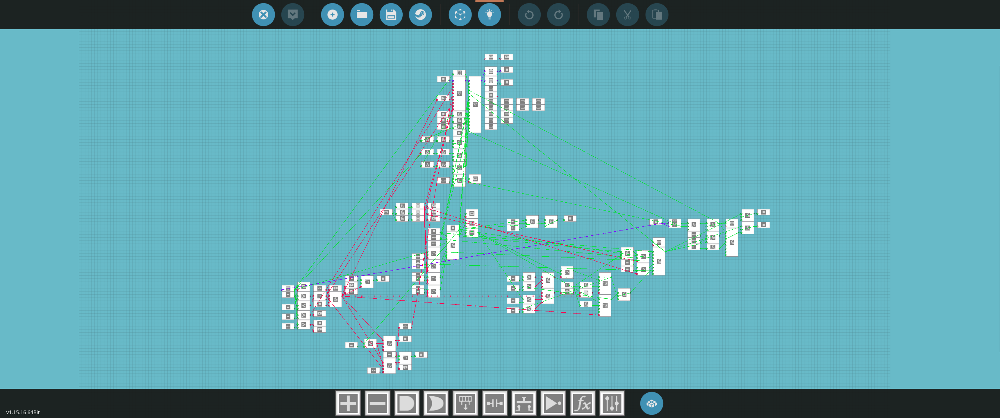
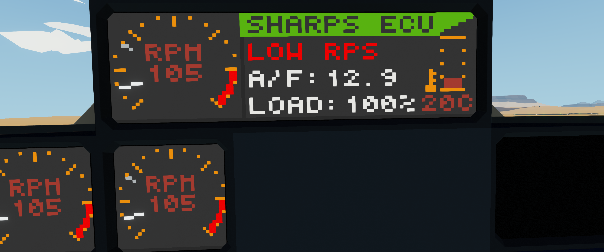

Note, this project was started in ~2020 and only uploaded to github in 2026.
This has been uploaded to the games workshop since 2021 -> https://steamcommunity.com/sharedfiles/filedetails/?id=2584952063

# Stormworks Diesel ECU Display

A custom Lua-based engine monitoring and diagnostics display for Stormworks.

This project provides a real-time engine dashboard featuring:
- RPM / RPS monitoring
- Fuel consumption tracking
- Runtime monitoring
- Battery diagnostics
- Temperature monitoring
- Touchscreen controls
- Warning and status system

## Screenshots

---

## Features

### Engine Monitoring
- Live RPM and RPS display
- Engine load monitoring
- Air/Fuel ratio display
- High temperature warning system

### Fuel System
- Fuel level display
- Fuel consumption rate
- Estimated time until empty

### Electrical System
- Battery level monitoring
- Generator output display
- Battery drain/charge statistics

### UI Features
- Touchscreen interaction
- Toggleable display modes
- Analog dial rendering
- Custom graphics rendering
- 96x96 optimized interface

---

## Technical Notes

The display system is designed for:
- Stormworks Width x Height - > 32x32, 96x32, 96x64 monitor
- Real-time engine diagnostics
- Low-overhead rendering
- Touchscreen interaction

The compact Lua version uses:
- Shortened variable names
- Aliased math functions
- Minimized whitespace
- Reduced character usage

to remain within Stormworks microcontroller limitations.

---

## Future Improvements

- CAN-style data bus support
